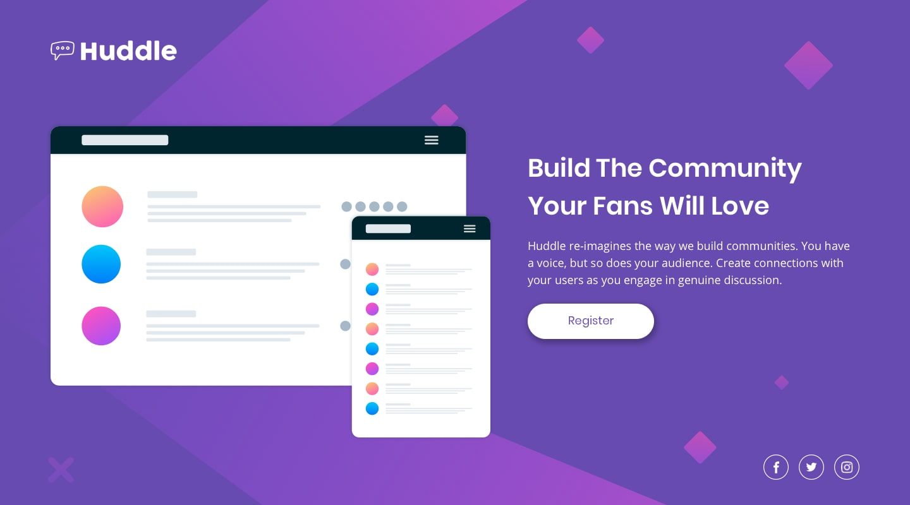
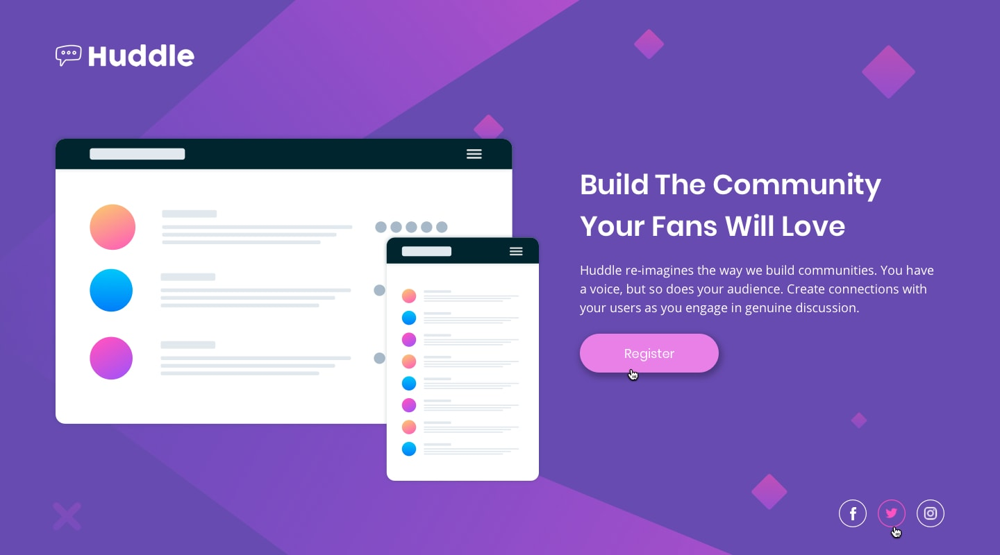

# Huddle landing page

Esta é uma solução para o desafio do módulo de HTML e CSS intermediário do curso DevQuest.

## Visão Geral 

###  Projeto 
<b>O objetivo é criar uma página de destino responsiva com uma única sessão, utilizando HTML e CSS.

###  Desafio
<b>O desafio consiste em construir uma página a partir dos designs fornecidos. A página deve ser responsiva, adaptando-se a diferentes tamanhos de tela, e incluir estados de hover para todos os elementos interativos.

### Funcionalidades 
<ul>
<li>Layout responsivo para diferentes tamanhos de tela;
<li>Estados de hover para botões e links interativos;
</ul>

### Capturas de tela 
 
Preview:  

 
Preview mobile:  

 
Preview - elementos interativos:  

  

### Links 
<ul>
<li><a href="https://github.com/fernanda-nunes/huddle-landing-page-frontend-mentor">Repositório</a></li>
<li><a href="https://fernanda-nunes.github.io/huddle-landing-page/" target="_blank">Site ao vivo</a></li>
</ul>

## O que eu aprendi 

<b> Durante o desenvolvimento deste projeto, tive a oportunidade de consolidar e expandir minhas habilidades em desenvolvimento front-end. 
